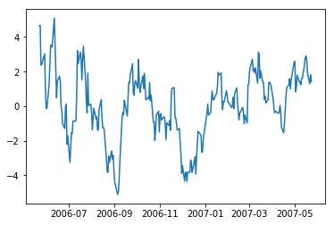

# How to Form a Good Cointegrating (and Mean-Reverting) Pair of Stocks


```python
import numpy as np
```


```python
import pandas as pd
```


```python
import matplotlib.pyplot as plt
```


```python
from statsmodels.tsa.stattools import coint
```


```python
from statsmodels.api import OLS
```


```python
df1=pd.read_excel('GLD.xls')
```


```python
df2=pd.read_excel('GDX.xls')
```


```python
df=pd.merge(df1, df2, on='Date', suffixes=('_GLD', '_GDX'))
```


```python
df.set_index('Date', inplace=True)
```


```python
df.sort_index(inplace=True)
```


```python
trainset=np.arange(0, 252)
```


```python
df=df.iloc[trainset,]
```

## Run cointegration (Engle-Granger) test


```python
coint_t, pvalue, crit_value=coint(df['Adj Close_GLD'], df['Adj Close_GDX'])
```


```python
(coint_t, pvalue, crit_value) # abs(t-stat) > critical value at 95%. pvalue says probability of null hypothesis (of no cointegration) is only 1.8%
```


    (-2.3591268376687244,
     0.3444494880427884,
     array([-3.94060523, -3.36058133, -3.06139039]))


## Determine hedge ratio


```python
model=OLS(df['Adj Close_GLD'], df['Adj Close_GDX'])
```


```python
results=model.fit()
```


```python
hedgeRatio=results.params
```


```python
hedgeRatio
```


    Adj Close_GDX    1.631009
    dtype: float64


##  spread = GLD - hedgeRatio*GDX


```python
spread=df['Adj Close_GLD']-hedgeRatio[0]*df['Adj Close_GDX']
```


```python
plt.plot(spread)
```

    C:\ProgramData\Anaconda3\lib\site-packages\pandas\plotting\_converter.py:129: FutureWarning: Using an implicitly registered datetime converter for a matplotlib plotting method. The converter was registered by pandas on import. Future versions of pandas will require you to explicitly register matplotlib converters.
    
    To register the converters:
    	>>> from pandas.plotting import register_matplotlib_converters
    	>>> register_matplotlib_converters()
      warnings.warn(msg, FutureWarning)
    


    [<matplotlib.lines.Line2D at 0x1bdd06ad240>]




