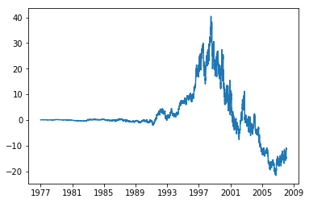

# How to Form a Good Cointegrating (and Mean-Reverting) Pair of Stocks


```python
import numpy as np
```


```python
import pandas as pd
```


```python
import matplotlib.pyplot as plt
```


```python
from statsmodels.tsa.stattools import coint
```


```python
from statsmodels.api import OLS
```


```python
from scipy.stats import pearsonr
```


```python
df1=pd.read_excel('KO.xls')
```


```python
df2=pd.read_excel('PEP.xls')
```


```python
df=pd.merge(df1, df2, on='Date', suffixes=('_KO', '_PEP'))
```


```python
df.set_index('Date', inplace=True)
```


```python
df.sort_index(inplace=True)
```

## Run cointegration (Engle-Granger) test


```python
coint_t, pvalue, crit_value=coint(df['Adj Close_KO'], df['Adj Close_PEP'])
```


```python
(coint_t, pvalue, crit_value) # abs(t-stat) < critical value at 90%. pvalue says probability of null hypothesis (of no cointegration) is 73%
```


    (-1.5815517041517178,
     0.7286134576473527,
     array([-3.89783854, -3.33691006, -3.04499143]))


## Determine hedge ratio


```python
model=OLS(df['Adj Close_KO'], df['Adj Close_PEP'])
```


```python
results=model.fit()
```


```python
hedgeRatio=results.params
```


```python
hedgeRatio
```


    Adj Close_PEP    1.011409
    dtype: float64


##  spread = KO - hedgeRatio*PEP


```python
spread=df['Adj Close_KO']-hedgeRatio[0]*df['Adj Close_PEP']
```


```python
plt.plot(spread) # Figure 7.2
```


    [<matplotlib.lines.Line2D at 0x2728e431b00>]





## Correlation test


```python
dailyret=df.loc[:, ('Adj Close_KO', 'Adj Close_PEP')].pct_change()
```


```python
dailyret.corr()
```


<div>
<style scoped>
    .dataframe tbody tr th:only-of-type {
        vertical-align: middle;
    }

    .dataframe tbody tr th {
        vertical-align: top;
    }

    .dataframe thead th {
        text-align: right;
    }
</style>
<table border="1" class="dataframe">
  <thead>
    <tr style="text-align: right;">
      <th></th>
      <th>Adj Close_KO</th>
      <th>Adj Close_PEP</th>
    </tr>
  </thead>
  <tbody>
    <tr>
      <th>Adj Close_KO</th>
      <td>1.000000</td>
      <td>0.484924</td>
    </tr>
    <tr>
      <th>Adj Close_PEP</th>
      <td>0.484924</td>
      <td>1.000000</td>
    </tr>
  </tbody>
</table>
</div>


```python
dailyret_clean=dailyret.dropna()
```


```python
pearsonr(dailyret_clean.iloc[:,0], dailyret_clean.iloc[:,1]) # first output is correlation coefficient, second output is pvalue.
```


    (0.4849239439370571, 0.0)


